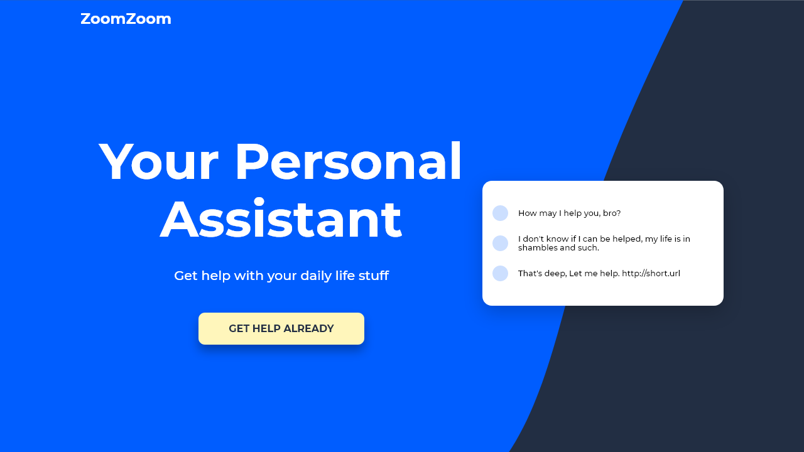
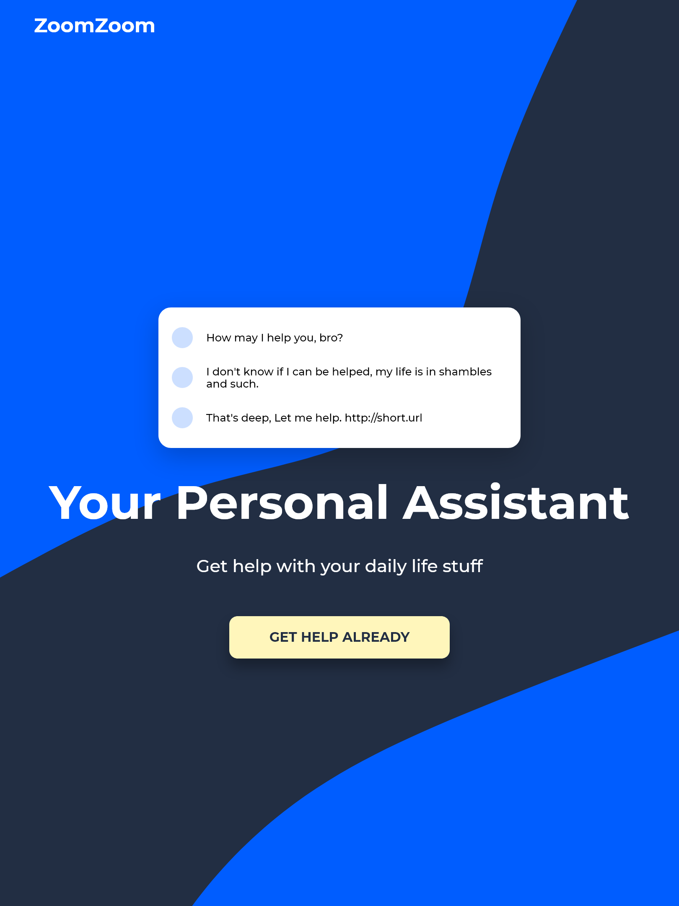
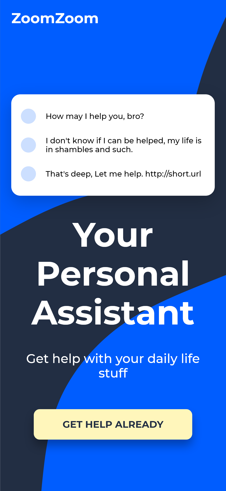

<!-- markdownlint-disable MD033 -->
<h1 align="center">Coursetro - Learning about Sass</h1>

Free tutorial about <a href="https://youtu.be/roywYSEPSvc">Sass Fundamentals from <em>Coursetro</em></a>

<h3 align="center">Languages</h3>

  <a href="#">English</a> • <a href="./lang/README.pt-br.md">Português</a>

<!-- markdownlint-enable MD033 -->

## Table of contents

- [Overview](#overview)
  - [The challenge](#the-challenge)
  - [Screenshots](#screenshots)
  - [Links](#links)
- [My process](#my-process)
  - [Built with](#built-with)
  - [What I learned](#what-i-learned)
- [Author](#author)

## Overview

### The challenge

- Create a website using Sass
- Dynamic background (personal challenge)

### Screenshots

| Desktop View (1280px) | iPad View (768/810px) | iPhone View (375px) |
|-------|-------|-------|
||||

### Links

- Live Site URL: [Github Pages](https://amodeusr.github.io/Sassy/)

## My process

### Built with

- Semantic HTML5 markup
- Sass variables, mixins and functions
- Flexbox
- Mobile-first workflow

### What I learned

### *Sass*

I learned about the fundamentals of Sass, how to use sass variables, and the basic usage of mixins and functions as well as how powerful such functionalities are. It was a really thrilling experience to see how practical it becomes to write css through Sass!

### *Dynamic background*

Creating a dynamic background wasn't as complex as I though it could be. Since I've done [something similar](https://amodeusr.github.io/EP02-SPAmodeusR/) before it helped me a little, however, differently from the quoted case, in this website I applied the background in a way it would change the website's appearance depending on the platform it's visualized, through a dynamic background which resizes itself accordingly to the user's screen.

## Author

- Github - [@AmodeusR](https://www.github.com/amodeusr)
- Linkedin - [@AmodeusR](https://www.linkedin.com/in/AmodeusR)
- Frontend Mentor - [@AmodeusR](https://www.frontendmentor.io/profile/AmodeusR)
