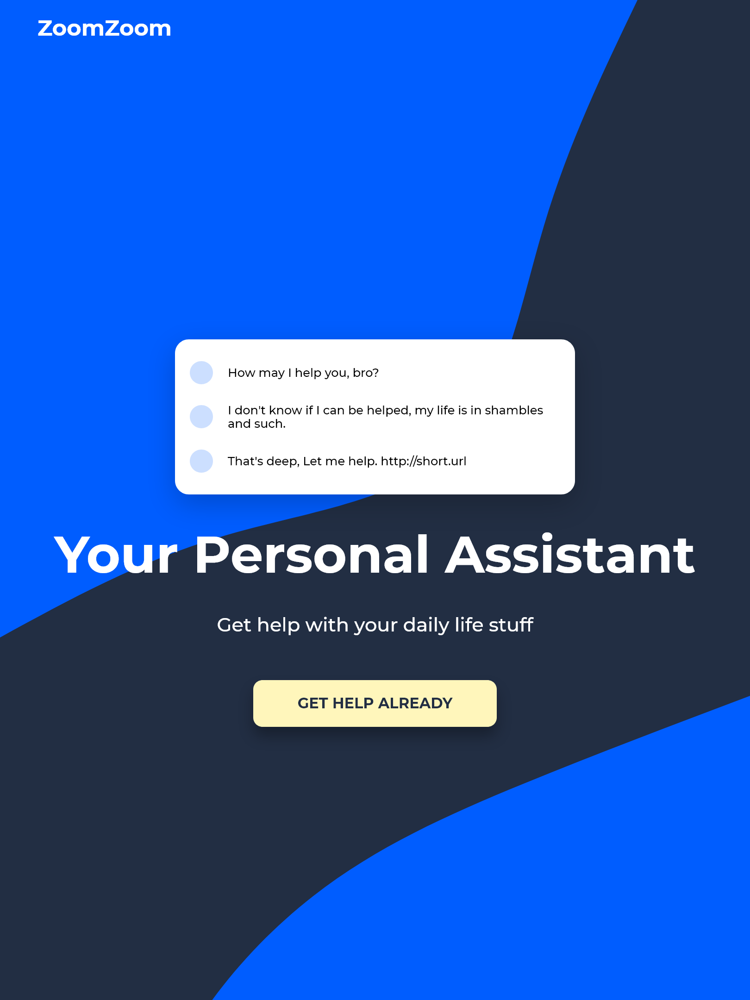

<!-- markdownlint-disable MD033 -->
<h1 align="center">Coursetro - Fundamentos de Sass</h1>

Aula gratuita sobre <a href="https://youtu.be/roywYSEPSvc">Fundamentos de Sass por <em>Coursetro</em></a>

<h3 align="center">Idiomas</h3>

  <a href="../README.md">English</a> • <a href="#">Português</a>

<!-- markdownlint-enable MD033 -->

## Índice

- [Visão Geral](#visão-geral)
  - [O desafio](#o-desafio)
  - [Capturas de tela](#capturas-de-tela)
  - [Links](#links)
- [Meu processo](#meu-processo)
  - [Desenvolvido com...](#desenvolvido-com)
  - [O que aprendi](#o-que-aprendi)
- [Autor](#autor)

## Visão geral

### O desafio

- Criar uma página web usando Sass
- Plano de fundo dinâmico (desafio pessoal)

### Capturas de tela

| Tela Desktop (1280px) | Tela iPad (768px) | Tela iPhone (375px) |
|-------|-------|-------|
|||| |

### Links

- URL para o Site: [Github Pages](https://amodeusr.github.io/Sassy/)

## Meu processo

### Desenvolvido com...

- Marcação semântica HTML
- Funções, mixins e variáveis Sass
- Flexbox
- Abordagem mobile-first

### O que aprendi

### *Sass*

Eu aprendi sobre os fundamentos de Sass, como usar variáveis Sass, e o uso básico de mixins e funções, assim como o quão poderoso são tais funcionalidades. Foi realmente uma experiência excepcional ver o quão prático se torna escrever css através do Sass!

### *Plano de fundo dinâmico*

Criar um plano de fundo dinâmico não foi tão complexo quanto pensei que poderia ser. O fato de eu ter feito [Algo parecido](https://amodeusr.github.io/EP02-SPAmodeusR/) me ajudou um pouco, porém, diferentemente do caso citado, neste site eu apliquei o fundo de forma a mudar a aparência do site dependendo da plataforma em que se o vê, através de um fundo dinâmico que se redimensiona segundo o tamanho da tela do usuário.  

## Autor

- Github - [@AmodeusR](https://github.com/amodeusr)
- Linkedin - [@AmodeusR](https://www.linkedin.com/in/AmodeusR)
- Frontend Mentor - [@AmodeusR](https://www.frontendmentor.io/profile/AmodeusR)
